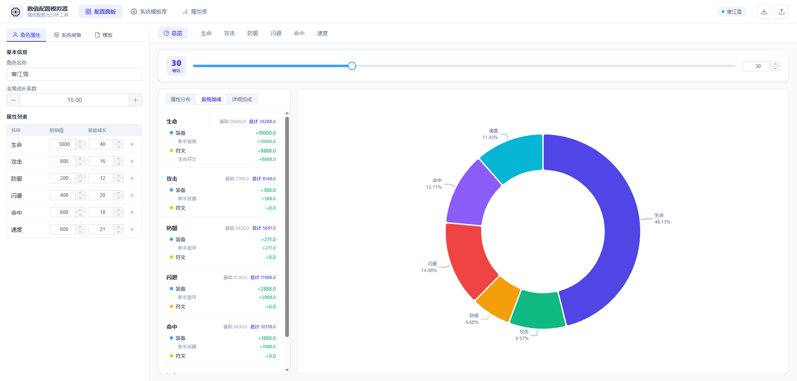
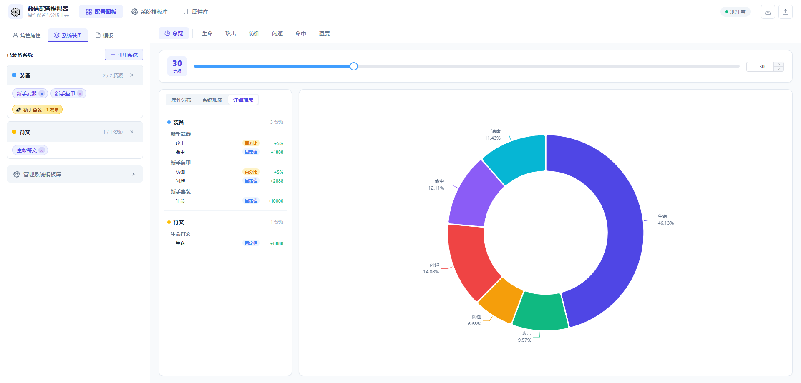
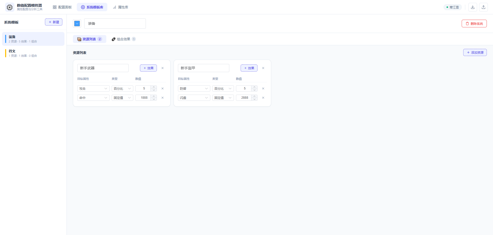
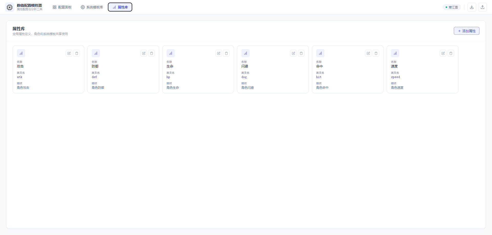

# ⚙️ 数值配置模拟器

> *"别人还在用 Excel 调数值的时候，你已经在用可视化神器一键起飞了。"*

**作者：阿寒** — 一个被代码耽误的数值策划，一个被数值策划耽误的全栈工程师。

---

## 📸 界面预览

| 主界面 | 装备界面 |
|:---:|:---:|
|  |  |

| 系统配置 | 属性定义 |
|:---:|:---:|
|  |  |

---

## 🤔 这是什么？

你是否曾经：

- 盯着一张 Excel 表格，试图理解 100 级角色的攻击力到底是怎么算出来的？
- 改了一个成长系数，然后花 20 分钟手动验证所有属性有没有崩？
- 跟策划争论"这个百分比加成到底叠不叠加"，最后谁也说服不了谁？

**数值配置模拟器**就是为了终结这些痛苦而生的。

它是一个**实时可视化的数值配置工具**，让你像搭积木一样配置角色属性、成长系统、装备效果，然后立刻看到结果。拖一下滑块，100 级的全属性分布饼图就在眼前旋转。这不是魔法，这是工程。

---

## ✨ 功能一览

### 🎭 角色配置
- 自定义角色名称和全局成长系数
- 从属性库中挑选属性，设置初始值和基础成长
- 一键装备/卸载成长系统，灵活选择激活的资源

### 📦 系统模板库
- 创建和管理多个成长系统模板（武器、防具、技能树……随你定义）
- 每个系统包含多个资源，每个资源可配置多条效果（固定值 / 百分比）
- 每条效果有一个**级别**属性，决定计算顺序：
  - 同级别的百分比加成先**加法合并**
  - 不同级别按从低到高**依次乘算**
  - 例：基础攻击 100，级别0 固定+100，级别1 百分比+10%，级别2 百分比+10% → (100+100) × 1.1 × 1.1 = 242
- **组合效果**：当多个资源同时激活时触发额外加成，套装效果安排上

### 📊 属性库
- 全局属性定义中心，角色和系统模板共享引用
- 支持属性名称、英文标识、描述的完整管理
- 卡片式编辑界面，改完点保存，优雅且高效

### 📈 总览面板
- **属性分布**：饼图 + 进度条，一眼看清各属性占比
- **系统加成**：按属性维度展示每个系统的贡献值
- **详细加成**：按系统维度展示每条效果的类型和数值
- **等级滑块**：拖动即实时刷新，从 1 级到 100 级丝滑过渡

### 💾 模板系统
- 保存 / 加载 / 覆盖配置模板
- 一键恢复默认配置，手残也不怕

### 📤 导入导出
- JSON 格式导入导出，方便团队协作和版本管理

---

## 🚀 快速开始

### 环境要求
- Node.js >= 18
- npm >= 9

### 安装 & 启动

```bash
# 克隆项目
git clone <repo-url>
cd role-growth-visualizer

# 安装依赖
npm install

# 启动开发服务器
npm run dev
```

浏览器打开 `http://localhost:5173`，开始你的数值之旅。

### 构建生产版本

```bash
npm run build
```

产物在 `dist/` 目录，丢到任何静态服务器上就能跑。

### 运行测试

```bash
npm test
```

---

## 🏗️ 技术栈

| 技术 | 用途 |
|------|------|
| Vue 3 + Composition API | 响应式 UI 框架 |
| TypeScript | 类型安全，少写 bug |
| Pinia | 状态管理 |
| Element Plus | UI 组件库 |
| ECharts | 数据可视化图表 |
| Vite | 构建工具，快到飞起 |
| Vitest | 单元测试 |

---

## 📁 项目结构

```
src/
├── components/          # Vue 组件
│   ├── AppLayout.vue       # 顶部导航 + 页面路由
│   ├── ConfigPanel.vue     # 角色配置面板（属性/系统/模板）
│   ├── Dashboard.vue       # 仪表盘（图表容器）
│   ├── OverviewTab.vue     # 总览面板（分布/加成/详情）
│   ├── SystemEditor.vue    # 系统模板编辑器
│   ├── AttributeLibrary.vue # 属性库管理
│   └── AttributeStackedBarChart.vue # 属性堆叠柱状图
├── store/               # Pinia 状态管理
│   ├── roleConfig.ts       # 角色配置
│   ├── systemTemplate.ts   # 系统模板库
│   ├── attributeLibrary.ts # 属性库
│   └── template.ts         # 配置模板
├── engine/
│   └── calculator.ts       # 数值计算引擎
├── types/
│   └── index.ts            # TypeScript 类型定义
├── data/
│   └── defaultConfig.ts    # 默认配置
└── utils/
    ├── persistence.ts      # 导入导出工具
    └── validation.ts       # 数据校验
```

---

## 🎮 使用指南

1. **先去属性库**定义你的属性（攻击力、生命值、暴击率……想加啥加啥）
2. **去系统模板库**创建成长系统，添加资源和效果，配好组合效果
3. **回到配置面板**，给角色添加属性、装备系统、选择激活的资源
4. **打开总览**，拖动等级滑块，看着数值在眼前跳动，感受策划的快乐
5. **有需求需要加**，QQ:305773778，直接联系作者，加班加点出功能!

---

## 📜 License

MIT — 用就完了，不用谢。

---

<p align="center">
  <i>用爱和咖啡因驱动 ☕</i><br/>
  <i>— 阿寒</i>
</p>
